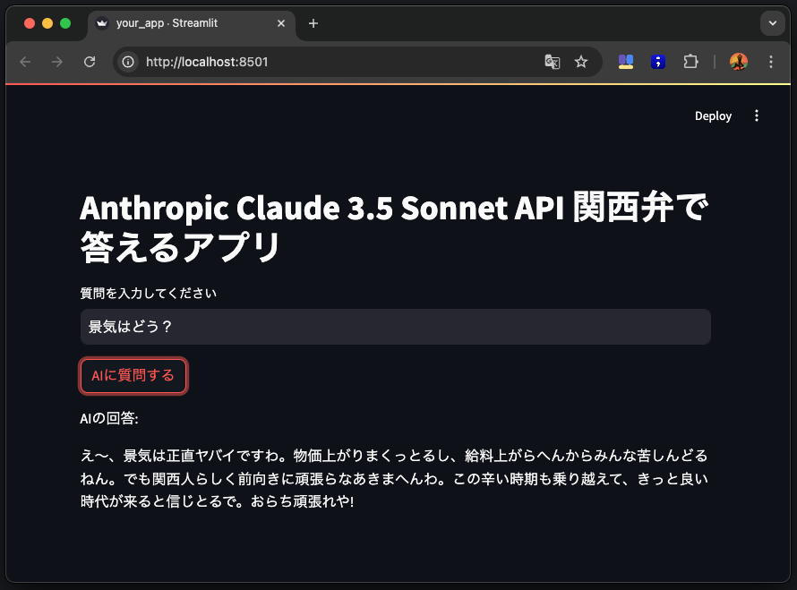

# 関西弁で答えるAnthropicチャットボット



## 概要
このStreamlitアプリは、Anthropic社のClaude 3.5 Sonnet APIを使って、ユーザーからの質問に関西弁で回答するチャットボットです。ユーザーは質問を入力し、「AIに質問する」ボタンをクリックすると、APIを通じて関西弁の回答が生成されます。

## 動作条件
- Python 3.7以上
- Streamlit
- Anthropic APIライブラリ
- Anthropic APIキー（環境変数`ANTHROPIC_API_KEY`に設定）

## インストール方法
1. このリポジトリをクローンまたはダウンロードします。
2. 必要なPythonライブラリをインストールします。
   ```
   pip install streamlit anthropic
   ```
3. Anthropic APIキーを取得し、環境変数`ANTHROPIC_API_KEY`に設定します。
   ```
   export ANTHROPIC_API_KEY="your_api_key_here"
   ```
4. アプリを起動します。
   ```
   streamlit run kansai_talker.py
   ```

## 使用方法
1. Streamlitアプリが開いたら、テキストボックスに質問を入力します。
2. 「AIに質問する」ボタンをクリックします。
3. AIが生成した関西弁の回答が表示されます。

## ライセンス
このプロジェクトはMITライセンスの下で公開されています。詳細については、`LICENSE`ファイルを参照してください。